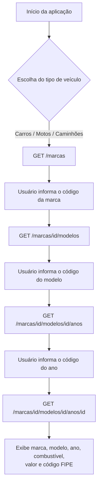

# Java API - Tabela FIPE
 
Cliente Java de linha de comando que consome a [API pública da Tabela FIPE](https://deividfortuna.github.io/fipe/) para consultar marcas, modelos, anos e o valor de mercado de veículos diretamente pelo terminal.
 
> **Nota:** apesar do nome do repositório, este projeto não expõe endpoints próprios — ele é um **consumidor** da API FIPE, não um provedor. O Spring Boot é usado aqui só como container de injeção de dependência (não há camada web).
 
## Sumário
 
- [Sobre o projeto](#sobre-o-projeto)
- [Funcionalidades](#funcionalidades)
- [Tecnologias utilizadas](#tecnologias-utilizadas)
- [Como funciona](#como-funciona)
- [Estrutura do projeto](#estrutura-do-projeto)
- [Pré-requisitos](#pré-requisitos)
- [Como executar](#como-executar)
- [Exemplo de uso](#exemplo-de-uso)
- [Notas técnicas](#notas-técnicas)
- [Conceitos praticados](#conceitos-praticados)
- [Autor](#autor)
## Sobre o projeto
 
O projeto foi desenvolvido para praticar consumo de APIs REST em Java puro, modelagem orientada a objetos com Records e organização de um backend em camadas (`model` / `service` / `main`). O usuário interage via terminal, navegando por um funil de escolhas — tipo de veículo → marca → modelo → ano — até chegar no valor FIPE do veículo selecionado.
 
## Funcionalidades
 
- Consulta de marcas por tipo de veículo (carros, motos ou caminhões)
- Consulta de modelos disponíveis para a marca escolhida
- Consulta dos anos disponíveis para o modelo escolhido
- Consulta do valor FIPE, combustível e código FIPE do veículo final
- Desserialização de JSON com Jackson (`@JsonAlias`, `@JsonIgnoreProperties`)
- Ordenação alfabética das listas de marcas e modelos exibidas
## Tecnologias utilizadas
 
| Tecnologia | Uso no projeto |
|---|---|
| Java 17 | Linguagem principal, com Records para os modelos de dados |
| Spring Boot 4.0.6 | Apenas injeção de dependência (`@Component`, `@Service`) — sem camada web |
| Jackson Databind 2.21.3 | Desserialização das respostas JSON da API FIPE |
| `java.net.http.HttpClient` | Cliente HTTP nativo do Java para consumo da API (sem RestTemplate/WebClient) |
| Maven | Build e gerenciamento de dependências (wrapper incluso, não precisa instalar Maven) |
 
## Como funciona
 

 
Cada etapa faz uma chamada HTTP à API FIPE, converte o JSON retornado em Records Java via Jackson, e imprime o resultado formatado no console antes de pedir a próxima escolha ao usuário.
 
## Estrutura do projeto
 
```
src
├── main
│   ├── java/fiap/com/fipeapi
│   │   ├── FipeapiApplication.java   # ponto de entrada (Spring Boot)
│   │   ├── main
│   │   │   └── Main.java             # orquestra o fluxo do menu no console
│   │   ├── model
│   │   │   ├── Brand.java            # record: marca
│   │   │   ├── BrandResponse.java    # record: lista de marcas + impressão
│   │   │   ├── VehicleModel.java     # record: modelo
│   │   │   ├── ModelResponse.java    # record: lista de modelos + impressão
│   │   │   ├── VehicleYear.java      # record: ano disponível
│   │   │   └── VehicleOverall.java   # record: dados finais do veículo
│   │   └── service
│   │       ├── ApiConsume.java       # chamada HTTP à API FIPE
│   │       ├── UrlGetter.java        # monta as URLs da API por etapa
│   │       ├── TypeGetter.java       # normaliza a entrada do tipo de veículo
│   │       ├── DataConverter.java    # desserialização JSON → objetos (Jackson)
│   │       ├── IDataConverter.java   # contrato de conversão (genéricos)
│   │       ├── IDataPrinter.java     # contrato funcional de impressão
│   │       └── FipeService.java      # expõe a api.key configurada
│   └── resources
│       └── application.properties
└── test
    └── java/fiap/com/fipeapi
        └── FipeapiApplicationTests.java
```
 
## Pré-requisitos
 
- JDK 17 ou superior
- Conexão com a internet (a aplicação consulta a API FIPE em tempo real)
- Não é necessário instalar o Maven — o projeto já inclui o Maven Wrapper (`mvnw` / `mvnw.cmd`)
## Como executar
 
**1. Clone o repositório**
```bash
git clone https://github.com/PietroRuotolo/java-api-tabelaFIPE.git
cd java-api-tabelaFIPE
```
 
**2. Defina a variável de ambiente `FIPE_API_KEY`**
 
`application.properties` referencia `${FIPE_API_KEY}`, e o Spring Boot falha ao subir se essa variável não existir no ambiente — mesmo que o valor ainda não seja usado nas chamadas à API (veja [Notas técnicas](#notas-técnicas)). Por enquanto, qualquer valor resolve:
 
```bash
# Linux/Mac
export FIPE_API_KEY=qualquer-valor
 
# Windows (PowerShell)
$env:FIPE_API_KEY="qualquer-valor"
```
 
**3. Execute o projeto**
 
Linux/Mac:
```bash
./mvnw spring-boot:run
```
 
Windows:
```bash
mvnw spring-boot:run
```
 
## Exemplo de uso
 
```
SEJA BEM VINDO AO CONSULTOR DA TABELA FIPE
------------------------------------------
Escolha o tipo de veículo:
Carros
Motos
Caminhões
> carros
 
CÓDIGO                   NOME
59----------------------VW - VolksWagen
...
 
Selecione a marca do veículo [INSIRA O CÓDIGO]: 59
 
CÓDIGO                   MODELO
5940-------------------Gol 1.0
...
 
Selecione o modelo do veículo [INSIRA O CÓDIGO]: 5940
 
Ano: 2020 Gasolina
Código: 2020-1
...
 
Selecione o ano do veículo [INSIRA O CÓDIGO]: 2020-1
 
INFORMAÇÕES GERAIS DO VEÍCULO:
 
Marca: VW - VolksWagen
Modelo: Gol 1.0
Ano do Modelo: 2020
Tipo de Combustível: Gasolina
Valor na Tabela FIPE: R$ 45.678,00
Código na Tabela FIPE: 005340-8
```
 
## Notas técnicas
 
- **A `FIPE_API_KEY` ainda não é enviada nas requisições.** `FipeService` expõe a propriedade, mas `ApiConsume`/`UrlGetter` não a utilizam hoje. A API FIPE v1 usada aqui (`parallelum.com.br/fipe/api/v1`) não exige autenticação — o provedor já disponibiliza uma [v2](https://fipe.online/docs/comece-aqui) com token opcional para aumentar o limite diário de requisições, o que é um bom próximo passo para dar uso real a essa chave.
- **Sem camada web.** O projeto depende de `spring-boot-starter` (não `spring-boot-starter-web`), então não existem controllers nem endpoints REST — o Spring aqui só resolve as dependências entre `Main` e `FipeService`.
- **Cliente HTTP nativo.** `ApiConsume` usa `java.net.http.HttpClient` diretamente em vez de `RestTemplate`/`WebClient`, evitando dependências extras só para chamadas GET simples.
## Conceitos praticados
 
- Consumo de APIs REST em Java
- Programação orientada a objetos
- Records e Enums
- Desserialização JSON com Jackson
- Generics e interfaces funcionais
- Injeção de dependência com Spring
- Organização de projeto backend em camadas
- Boas práticas com Git e commits semânticos
## Autor
 
Desenvolvido por **Pietro Ruotolo**, estudante de Engenharia de Software na FIAP.
 
GitHub: [github.com/PietroRuotolo](https://github.com/PietroRuotolo)
LinkedIn: [linkedin.com/in/pietro-ruotolo-540bb1427](https://linkedin.com/in/pietro-ruotolo-540bb1427)
